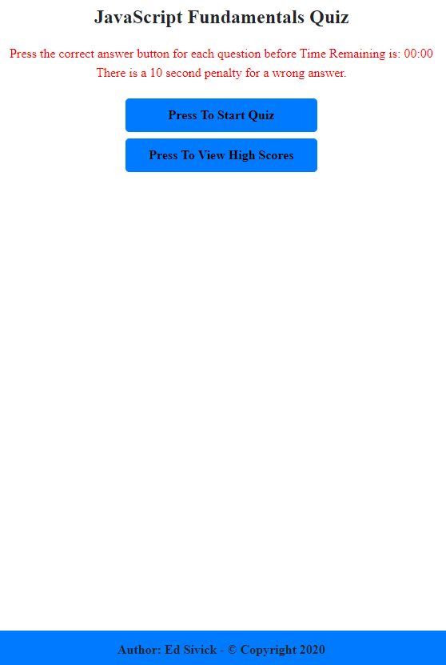
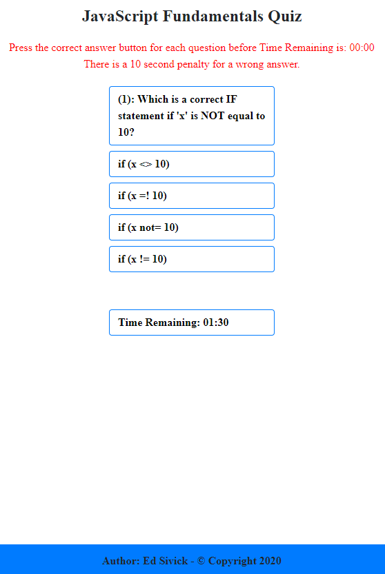
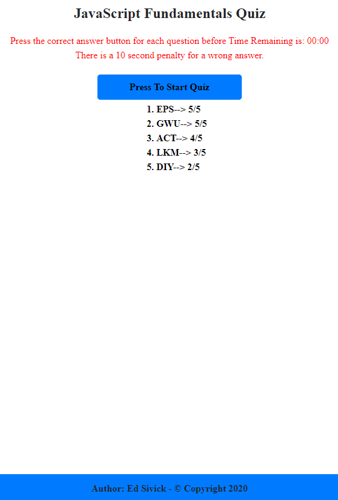

# Project Title: Code Quiz
___
## Objective
Build a timed code quiz with multiple-choice questions. The app will run in the browser and feature dynamically updated HTML and CSS powered by JavaScript code. It will also feature a clean and polished user interface and be responsive, ensuring that it adapts to multiple screen sizes.  
When the user clicks a start button, a timer will start and the user is presented with a question.  When the question is answered, another question is presented.  If the question is answered incorrectly, additional time is subtracted from the timer.  The game is over when all questions are answered or the timer reaches 0.  The user can then save their initials and quiz score.

___
## Layout: index.html
The HTML file was built using Bootstrap buttons with an embedded div used to display the High Scores List.  It consists of 9 rows.  Each row has has one column, **col-md-12**, and all buttons / text are positioned to the center of the page.  A sticky footer was added to display the Author and Copyright year.  
A total of seven buttons were utilized in the code:  
- a button to press and allow the user to start the quiz  
- a button to press and view the high scores  
- a button to display the quiz question  
- a button to press for selecting answer 1  
- a button to press for selecting answer 2
- a button to press for selecting answer 3  
- a button to press for selecting answer 4
- a button to view whether the answer is correct or wrong
- a button to view the time remaining for completing the quiz  

___
## Layout: style.css
The CSS file utilized styling that positioned all HTML elements in the center of the page. The purpose of this was to have the app responsive, giving it the ability to fit multiple screen sizes.  Color variations and text sizing were kept to a minimum.  A Comic Sans font was used throughout the page to give the HTML page a casual appearance.  The sticky footer was styled in the same manner as the previous "Responsive Portfolio" project.  A **media query** was added to change the content appearance (background color) below 576px viewport size.

___
## Layout: script.js
The JavaScript code was built around the use of 5 functions: **startQuiz()**, **setTime()**, **askQuestion(question)**, **quizAnswer()**, and **saveScore()**.
The **startQuiz** function was invoked when the user pressed the **Press To Start Quiz** button.  The button elements that were not directly part of this function operation were hidden, and others had display set to "none" to vacate their spaces taken on the viewport. The **setTime()** function was invoked, and the Time Remaining was initiated at 90 seconds. The **askQuestion(questions)** function was invoked, and cycled through the pre-defined questions, and answers that were stored in an object array.  The **quizAnswer()** function was invoked, as well as **addEventListener()** method after the user selected an answer button.  The function checked if the answer was correct/wrong, and updated the **userScore**.  When all of the questions were asked/answered, the **saveScore()** function was invoked.  The user had the option to save their initials and score to local storage using the **JSON.stringify** method.  The top 5 scores were sorted from highest to lowest using the **sort()** and **splice()** methods.   If the timer reached 0 before the user finished the quiz, an alert window displays stating that "The timer has expired. The Quiz is Over." The user then had the ability to save their initials and score. 

The user can view the Top 5 Scores by pressing the **Press To View High Scores"**. The code was processed after an **addEventListener()** method was triggered from the "click" of the button.  Again, the button elements that were not directly part of this code operation were hidden, and the "Press To View High Scores" button had its display set to "none" to vacate space for the High Scores List to occupy. The High Scores were retrieved from local storage using the **JSON.parse** method.  An ordered list was created from the High Scores array and displayed to a div in the HTML file having an Id of **listScores**.

___
## Summary
Coding assessments can be very advantageous to employers seeking qualified web developers.  Although it is not the only metric some employers use when judging prospective employees, many use it to determine the skill set of applicants. This project was difficult since there were many user and application operations to consider.  I challenged myself to complete this app using only one HTML and one JavaScript file. I was ablr to achieve this through the use of the visibility property in JavaScript that enabled me to use "hidden", "visible, and "none" on many HTML elements. It was definitely a very time consuming process with many trial and error code modifications.

## Application Links and Images  
**Links:**  
Application link: (https://ed-sivick.github.io/4-Web-APIs/)  
index.html code: (https://github.com/ed-sivick/4-Web-APIs/blob/master/index.html)  
JavaScript.js code: (https://github.com/ed-sivick/4-Web-APIs/blob/master/assets/script.js)  
style.css code: (https://github.com/ed-sivick/4-Web-APIs/blob/master/assets/style.css)

**Application Image Examples:** Hover the mouse over each image for a brief description. 

  
  
  
  

  

  
  
  
  

   

  
  
  
  
